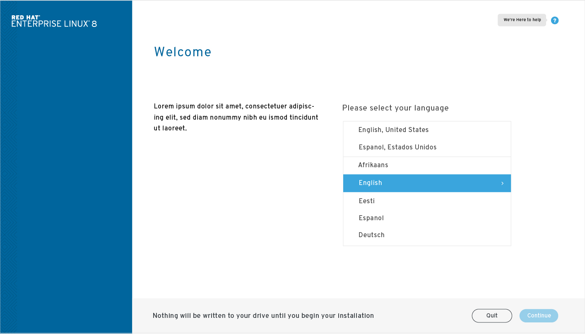
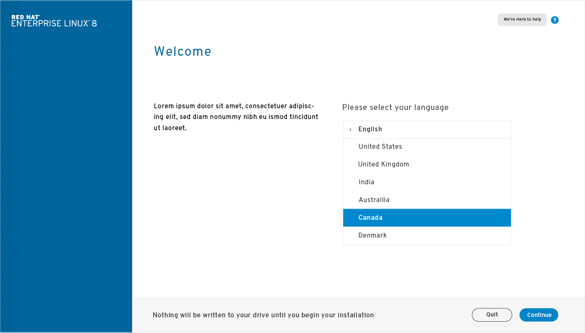

# Introduction
## Summary

The purpose of this screen is to offer language selection but also to clarify what the installer will do. The text should describe the process of the system scan and the following steps. The new installer aims to help the user navigate through the process without making any assumptions as to what they would prefer to adjust.

### Language selection
The language selection will have a list of the most likely choices based on location, or if location is not available, a list of the most common languages. Below that will be a full list of all available langues. A user can then select their language, if more than one dialect is available they will see all available options when selecting the parent language.

### Help menu
On the introduction page the help option is highlighted with a "we're here to help". This would only exist on this page. 

### Things to still be considered
- Subscription management
- option to add a kickstart type script to preset software selection etc.

### screen shots

