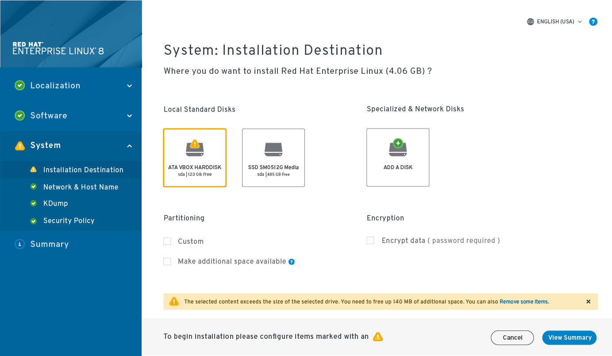
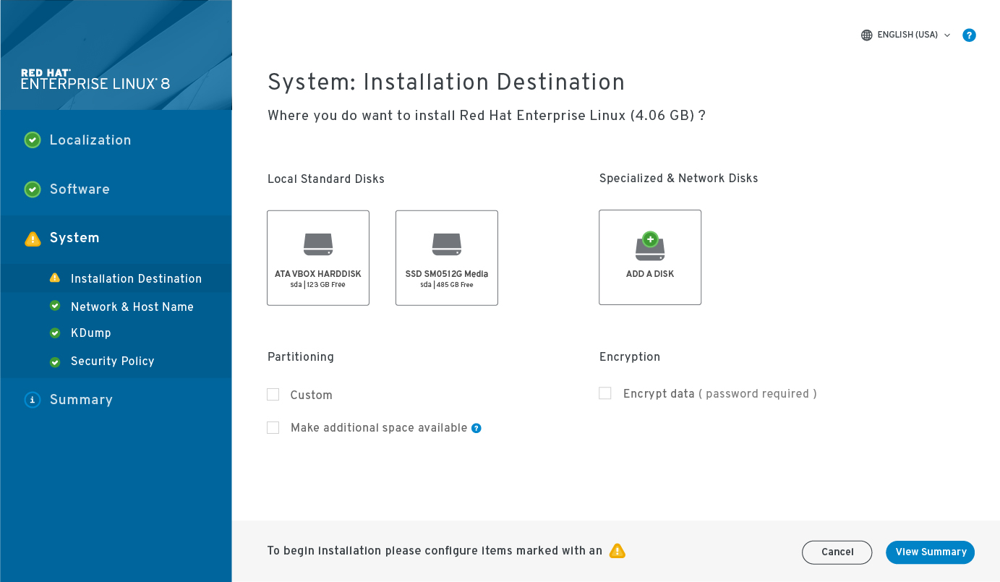
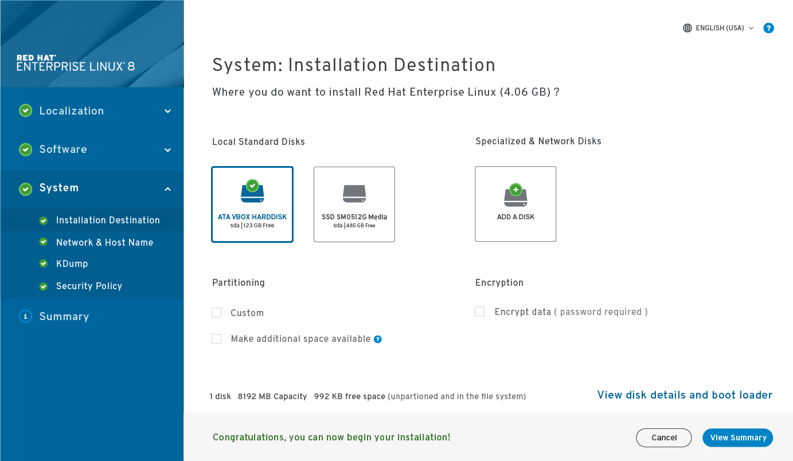

# Installation destination
The installation destination page is revised to show more emphasis on the selected item. This is an example of an item that needs attention before the install can begin. Both the side navigation and the bottom text advise the user to adjust the settings in this screen to continue with the install.

### Things to still be considered
- This page shows an example of inline help icons. What does it look like to offer help at this level?
- Partitioning
- Multiple drives chosen. How does this information get presented in the summary?
- Do we need to include a refresh option on this page?

## Installation destination with action required.

## Installation destination with confirmation.

## Installation destination with boot loader/disk details popup.

