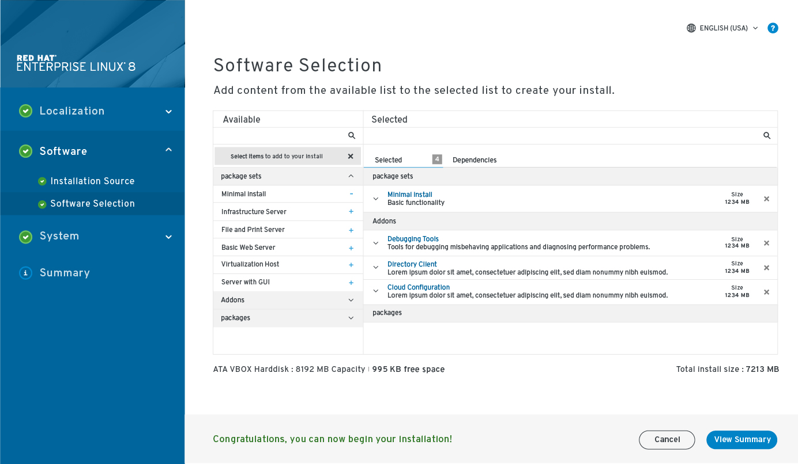
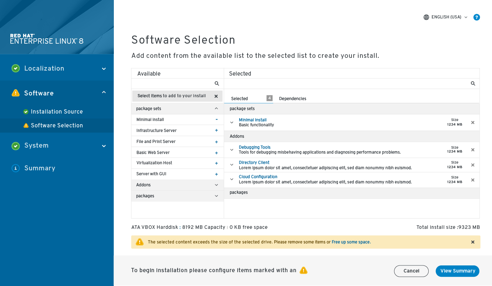

# Software Selection
This screen has expanded to offer more options for software selection. The proposal is to offer the user the ability to customize their install down to the package selection.
By Default the minimal install would be selected.
## Current selection size and installation destination selection capacity.
Below the available/selected layout is the name, capacity and free space of selected installation destination as well as the total of the selected items for the install.
## Inline error
When the selected items exceed the available space a dialog appears that encourages adjusting the selected items. There is also a link added to free up more space (this would lead the installation destination page with the "make available space" option active).

### Things to still be considered
- We still need to determine if the package level access will be available.
- Filtering/search should be added but not sure about having it on both available and selected. This will be influenced by the package depth we decide on.
- The expanded selected items still need more consideration.
## Software selection with selections

## Software selection with action required

