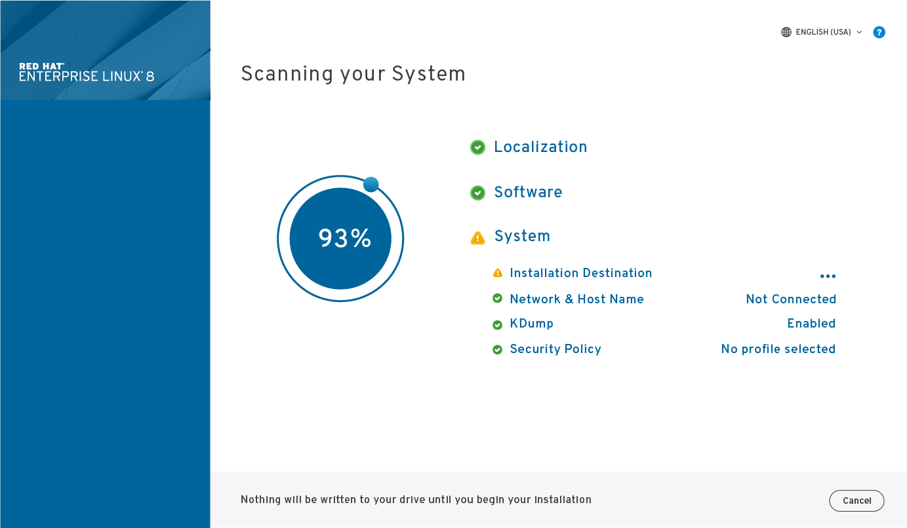
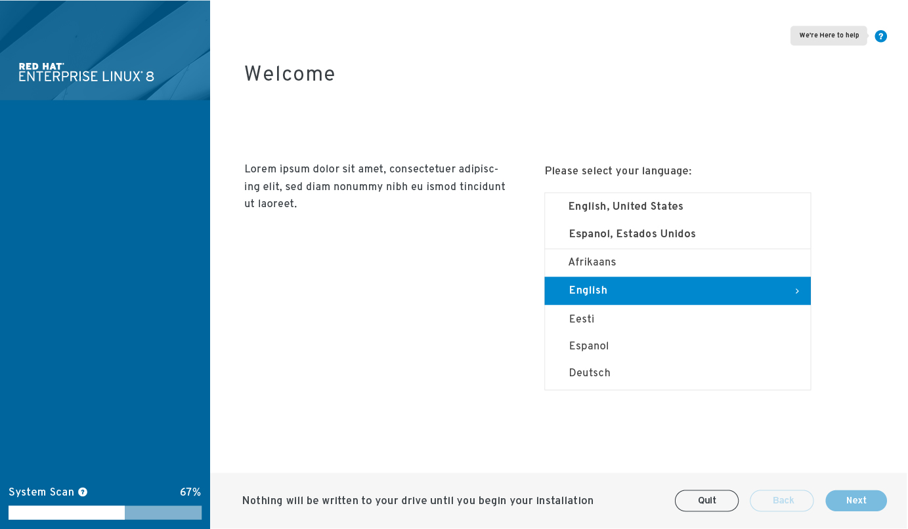

# System Scan
## Summary
The purpose of this screen is to acknowledge and bring to attention the system scan. It will also emphasize the items that need to be addressed before moving forward. Once the scan is complete the list will animate to the left column and direct the user to the first item that needs their attention.

### Things to still be considered

Below are two options for system scan. Through this process I have begun to wonder if we need to present this or if the icons along with the welcome language will confirm this.

